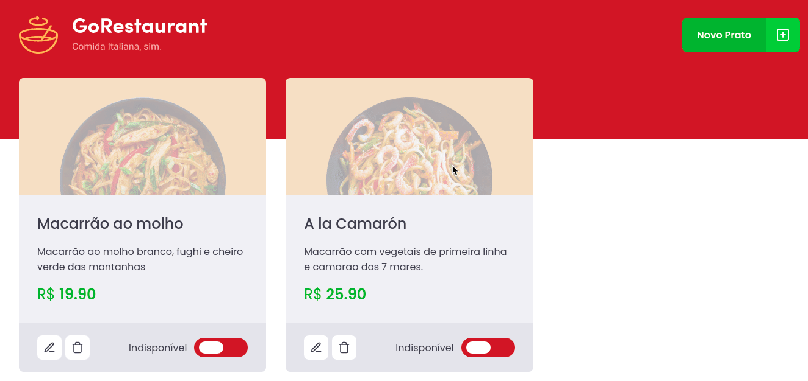
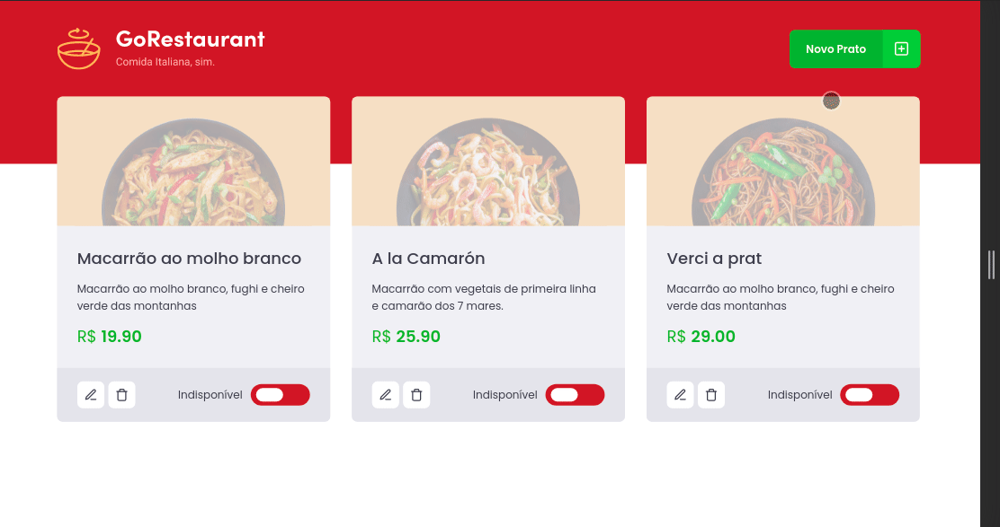

  

<h1 align="center">
  GoRestaurant
</h1>

  Desafio 04 - Refactoring de classes e typescript

## 📋 O Projeto
O GoRestaurant é uma aplicação de gerencimento de cardápio para restaurantes, permitindo cadastrar novos pratos, editá-los, deletá-los e alterar sua disponibilidade.

## 🧠 Desafio
> Essa será uma aplicação já funcional onde o seu principal objetivo é realizar dois processos de migração: de Javascript para Typescript e de Class Components para Function Components.

<h2 align="center">💡</h2>
Fazer esse desafio foi um pouco trabalhoso mas gostei de fazer. É importante lembrar que muitas aplicações ainda estão escritas em classes e Javascript, o que demanda saber fazer essa migração.

 

Nesse desafio pude praticar muito sobre Typescript e a configuração do seu ambiente, além de ter a experiência de lidar com uma aplicação já existente e realizar devidas manutenções.

## 🚀 Next Level

  
  <blockquote>Projeto responsivo</blockquote>

